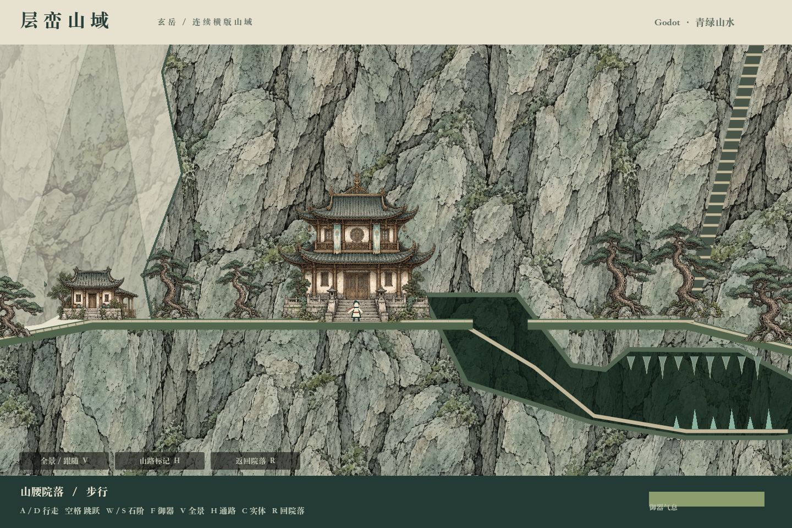
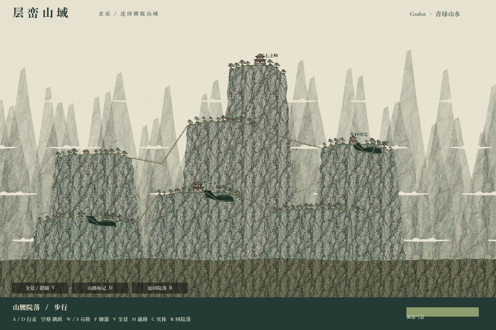
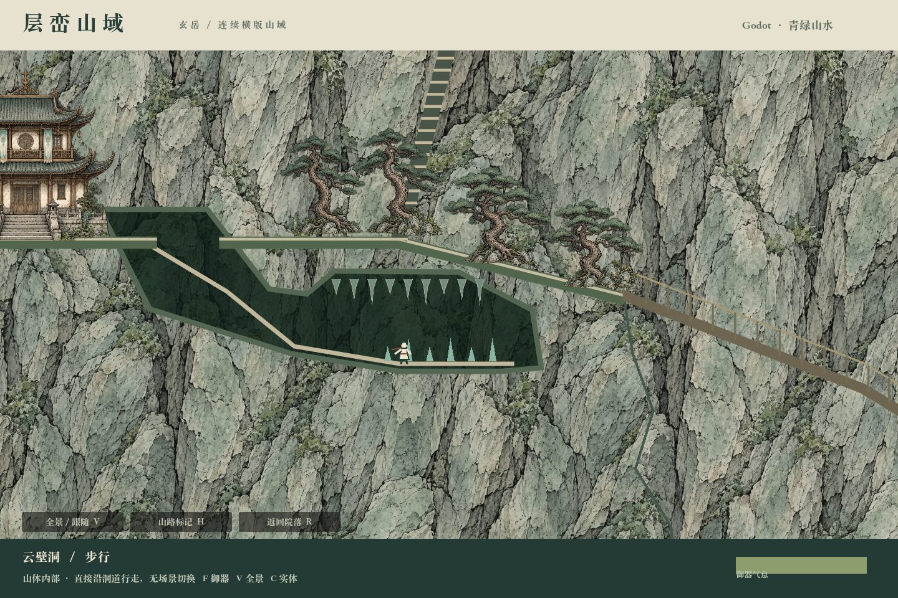
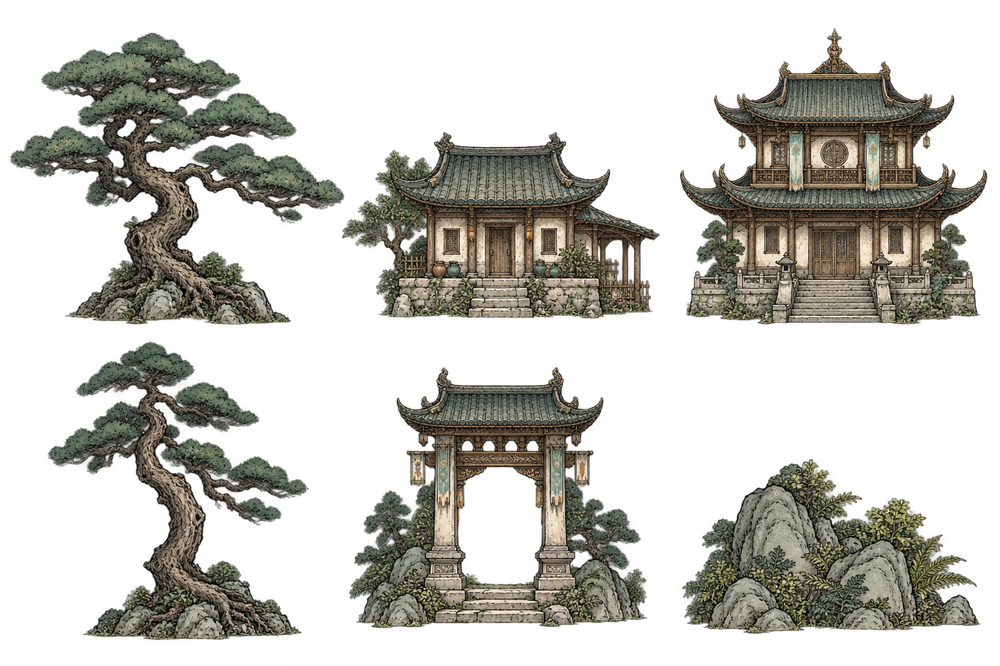

# 修仙世界 · 演化与行旅原型

一个拥有自主历史演化的连续横版修仙世界。目前分别验证自然灵气生态、世界地图和分层山域通行，尚未整合成完整游戏。

## 先从哪里看

| 版本 | 现在可以体验什么 | 入口 |
| --- | --- | --- |
| **Godot · 层峦山域（最新）** | 七处山体、高低台地、桥路、石阶、连续进入洞穴、步行与御器 | 用 Godot 导入 [`godot-demo/project.godot`](godot-demo/project.godot)，按 F5；[操作说明](godot-demo/README.md) |
| 浏览器 · 连续侧视行旅 | 横版行旅、分层山域与早期美术实验 | 启动本地服务后访问 [`/sideview/`](http://127.0.0.1:4173/sideview/) |
| 浏览器 · 横陆演化 | 大陆地形、灵气与植物演化的可行性实验 | [`/feasibility/`](http://127.0.0.1:4173/feasibility/) |
| 浏览器 · 自然生态观测 | 格子生态、收支、图层、局部编辑与模拟观察 | [`/`](http://127.0.0.1:4173/) |

**Godot 当前验证地形与通行，尚未迁入世界生态、经济和战斗。** 各原型仍有独立存档，浏览器的演化结果尚未自动驱动 Godot 场景。

## Godot 实际运行画面

跟随近景：人物在台地、树木和建筑之间行走，山体参与通行与碰撞。



| 全景：高低台地由桥路、石阶连接 | 洞内：走入山体，局部展示内部空间 |
| --- | --- |
|  |  |

### 运行 Godot

以 **Godot 4.7.2** 验证。安装引擎后导入 `godot-demo/project.godot`；引擎本体与导入缓存不随仓库分发。macOS 也可使用 [`启动场景.command`](godot-demo/启动场景.command)。

- A/D 行走，空格跳跃，W/S 沿石阶上下。
- F 开关御器，飞行时四向移动；V 切换全景／近景。
- 直接走进洞口，无需交互键；E 查看附近地点并恢复气息。
- H 通路辅助线，C 碰撞网格，R 回到院落，Esc 暂停。

## 资产在哪里

| 目录 / 文件 | 用途与状态 |
| --- | --- |
| [`godot-demo/assets/`](godot-demo/assets/) | **当前 Godot 资产**：`ink-atlas.png` 为树木、建筑、植被图集；`ink-rock.png` 为岩面材质；`layered-world.json` 为地形布局数据 |
| [`godot-demo/assets/qinglan-world.png`](godot-demo/assets/qinglan-world.png) | 早期整幅山水底画试作，保留参考，**当前场景不使用** |
| [`godot-demo/evidence/`](godot-demo/evidence/) | Godot 实际运行截图与检查结果，不是游戏纹理 |
| [`sideview/assets/`](sideview/assets/) | 浏览器横版山域使用的美术素材，与 Godot 新图集分开保存 |
| [`feasibility/assets/`](feasibility/assets/) | 大地图生态实验的图标、山石与植被图集 |
| [`参考图片/`](参考图片/) | 视觉与布局参考，不等于已接入场景的素材 |

下面是 **Godot 素材图集预览，不是游戏截图**。运行时将其中树木与建筑分别放置到台地上。



完整清单、文件大小与校验信息见 [资产索引](ASSETS.md)。下载 [v0.3.0 Godot demo 与资产包](https://github.com/AllenLeong/xiuxiuan/releases/tag/v0.3.0-godot)：Godot 包包含可导入的项目源码与素材；资产包汇总各版图像、参考与布局数据。两者均不包含引擎。

参考素材的收录不表示额外授权；仓库尚未指定统一开源许可。

## 运行浏览器版本

需要 Node.js 20 或更高版本，无第三方运行依赖。在仓库根目录运行：

```sh
npm start
```

然后打开上方表格中的本地入口。这些地址需要本地服务运行，GitHub README 本身不运行游戏。

生态地图支持拖动、缩放、点击检查格子、暂停与调速、局部编辑、JSON 存档导入导出。侧视版 A/D 行走、空格跳跃、W/S 升降、F 御器、E 交互、V 切换山域全景；M 行旅地图、O 世界记录。

## 设计与验证

- [自然生态验收标准](docs/08-browser-prototype-acceptance.md) · [验收进度](docs/10-acceptance-status.md)
- [连续侧视世界定义](docs/17-continuous-sideview-world.md) · [美术、尺度与前景规则](docs/18-mountain-art-and-immersion.md)
- [Godot 实现边界与检查说明](godot-demo/README.md) · [Godot 检查结果](godot-demo/evidence/checks.txt)

```sh
# 浏览器模拟检查（仓库根目录）
npm test
npm run verify

# Godot：首次导入资源，然后检查通行逻辑
# 将 godot 替换为本机 Godot 可执行文件路径
godot --headless --editor --path godot-demo --import
godot --headless --path godot-demo -- --test

# 重新生成资产清单与下载包
python3 scripts/package-assets.py
```

自动检查仅覆盖列出的断言，不代表完整游戏体验或全部世界规则已完成。
